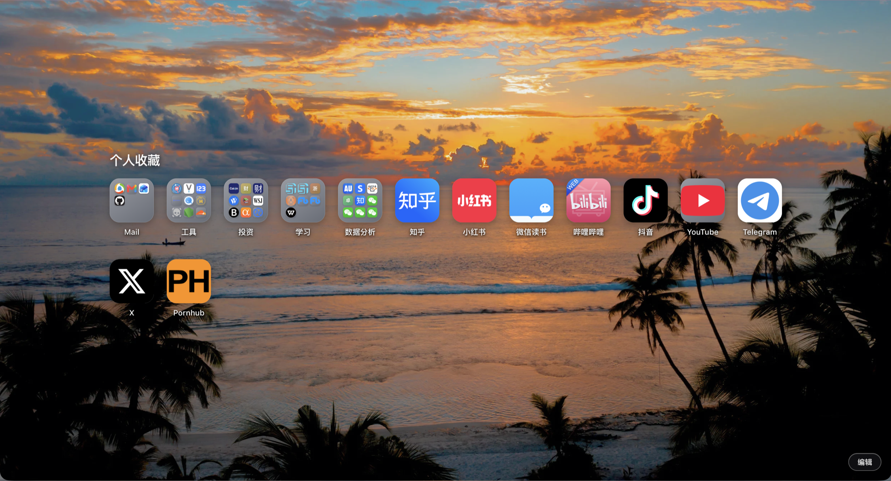

# 暮光起始页 · Twilight Start Page

一款精心打磨的 Safari 风格 Chrome 新标签页扩展。它提供独立的书签、分组、网站图标与背景管理，并将数据保存在本机。

A polished Safari-inspired new tab extension for Chrome, with its own local bookmarks, groups, website icons, and backgrounds.

[](manifest.json)
[](LICENSE)

[简体中文](#简体中文) · [English](#english)



## 简体中文

### 主要功能

- **Safari 风格布局**：书签尺寸、圆角、间距、行距、分组预览和玻璃拟态面板均按 Safari 起始页体验细致调整。
- **独立收藏系统**：书签与分组由扩展自己管理，不读取或修改 Chrome 自带书签。
- **书签分组**：首页显示分组预览，点击后进入分组页面；支持拖动排序。
- **网站图标**：可以从网站官方页面发现 Touch Icon、Web App Manifest 图标或 favicon，也可以使用 Google 官方 favicon 服务。
- **自定义图标**：支持上传 SVG、PNG、JPEG、WebP 和 AVIF；未获取到图标时以书签名称首字生成方形图标。
- **Safari 风格菜单**：右键书签可以打开、重命名、编辑地址、编辑图标、复制链接或删除。
- **自定义背景**：上传自己的背景图片，或一键恢复默认背景。
- **HTML 导入导出**：兼容 Safari 与 Chrome 的 Netscape Bookmark HTML；导入时合并现有收藏，并按网址跳过重复项。
- **本地保存**：书签、背景、自定义图标和图标缓存均保存在 Chrome 扩展存储中。

### 效果图

#### 起始页


#### 编辑面板


### 安装

1. 下载本仓库：点击 **Code → Download ZIP**，然后解压。
2. 在 Chrome 地址栏打开 `chrome://extensions/`。
3. 打开右上角的 **开发者模式**。
4. 点击 **加载已解压的扩展程序**。
5. 选择包含 `manifest.json` 的项目文件夹。
6. 新建标签页即可使用暮光起始页。

更新时拉取或重新下载代码，然后在 `chrome://extensions/` 中点击扩展卡片上的刷新按钮。

### 使用说明

- 点击书签打开网站；点击分组进入分组页面。
- 右击书签可编辑名称、地址与图标，或复制、删除书签。
- 拖动书签或分组可调整顺序。
- 点击右下角 **编辑** 可添加书签、创建分组、上传背景、刷新网站图标以及导入导出书签。
- **刷新网站图标** 会清除网站图标缓存并重新获取，不会删除自己上传的图标。
- **恢复初始内容** 会清空全部书签与分组，并恢复默认背景；操作前建议先导出书签 HTML。

### 图标来源

- **Safari 默认**：只从目标网站官方页面及同源资源发现 Touch Icon、Manifest 图标或 favicon。
- **Google 获取**：只使用 Google 官方 favicon 服务。
- **自己上传**：文件保存在本机扩展存储中，不会上传到服务器。

### 权限与隐私

扩展申请 `storage`、`unlimitedStorage` 以及 `http://*/*`、`https://*/*` 网站访问权限。网站访问权限仅用于读取书签网站声明的图标资源。扩展不申请 Chrome `bookmarks` 权限，不包含远程脚本，也不会上传收藏、背景或自定义图标。详情见 [隐私说明](PRIVACY.md)。

### 项目结构

```text
├── manifest.json          # Chrome Manifest V3 配置
├── newtab.html            # 新标签页结构
├── styles.css             # Safari 风格界面
├── app.js                 # 收藏、图标、拖动与导入导出逻辑
├── safari-bookmarks.js    # 初始数据迁移脚本
├── assets/                # 扩展图标与默认背景
└── docs/images/           # README 效果图
```

---

## English

### Features

- **Safari-inspired layout** with carefully tuned icon sizes, spacing, row gaps, group previews, and glass panels.
- **Independent bookmark library** that does not read or modify Chrome's built-in bookmarks.
- **Bookmark groups** with compact previews, dedicated group views, and drag-to-reorder support.
- **Website icons** discovered from the site's own Touch Icon, Web App Manifest, or favicon resources.
- **Google icon option** using Google's official favicon service.
- **Custom icons** with SVG, PNG, JPEG, WebP, and AVIF support. A square initial tile is used when no icon is available.
- **Safari-style context menus** for opening, renaming, editing, copying, and deleting bookmarks.
- **Custom backgrounds** stored locally, with one-click restore.
- **Safari and Chrome HTML import/export** using the Netscape Bookmark format. Imports merge with existing data and skip duplicate URLs.
- **Local-first storage** for bookmarks, backgrounds, custom icons, and icon cache.

### Screenshots

#### Start page


#### Edit panel


### Installation

1. Download the repository with **Code → Download ZIP**, then extract it.
2. Open `chrome://extensions/` in Chrome.
3. Enable **Developer mode**.
4. Click **Load unpacked**.
5. Select the project folder that contains `manifest.json`.
6. Open a new tab.

To update, pull or download the latest files and click the extension's reload button on `chrome://extensions/`.

### Usage

- Click a bookmark to open it, or click a group to enter its dedicated view.
- Right-click a bookmark to rename it, edit its URL or icon, copy it, or delete it.
- Drag bookmarks and groups to reorder them.
- Use **Edit** in the bottom-right corner to add content, change the background, refresh website icons, or import/export bookmark HTML.
- **Refresh website icons** clears fetched icon caches and downloads them again while preserving uploaded icons.
- **Restore initial content** clears every bookmark and group and restores the default background. Export a backup first if needed.

### Icon sources

- **Safari Default** discovers Touch Icons, Manifest icons, and favicons only from the bookmarked site's official page and same-origin resources.
- **Google Fetch** uses Google's official favicon service only.
- **Custom Upload** stays in local extension storage and is never sent to a server.

### Permissions and privacy

The extension requests `storage`, `unlimitedStorage`, and access to `http://*/*` and `https://*/*`. Website access is used only to discover icon resources declared by bookmarked sites. The extension does not request Chrome's `bookmarks` permission, includes no remote scripts, and does not upload bookmarks, backgrounds, or custom icons. See the full [Privacy Notice](PRIVACY.md).

### Disclaimer

Twilight Start Page is an independent project inspired by Safari's start page. It is not affiliated with or endorsed by Apple, Google, or the websites shown in the screenshots. Product names and logos belong to their respective owners.
