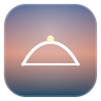
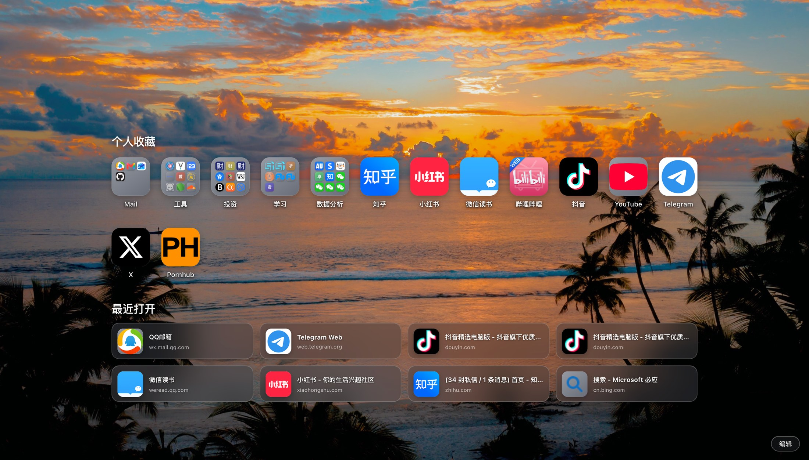
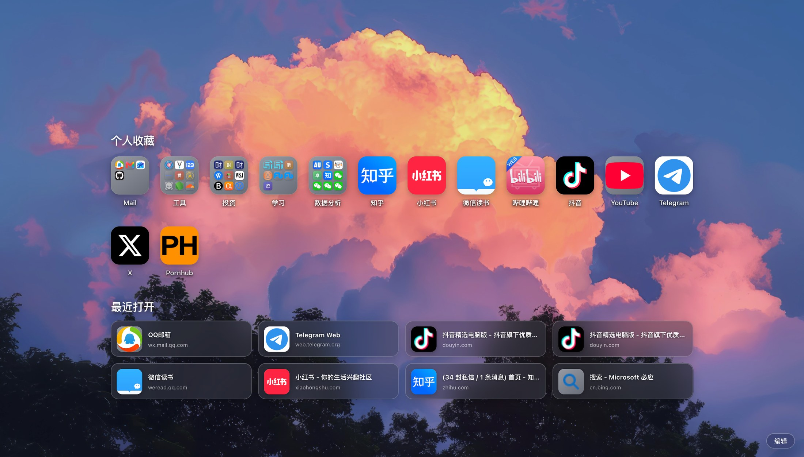
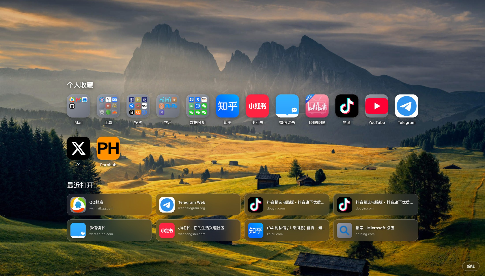
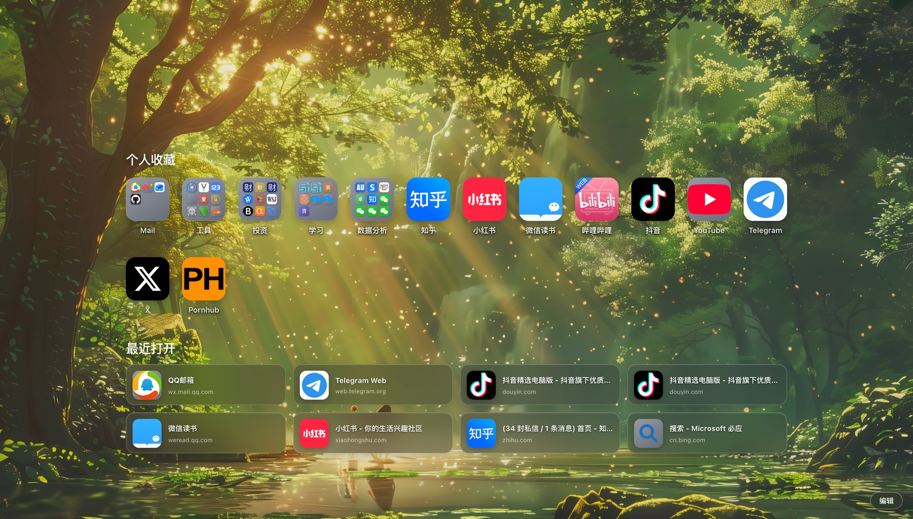
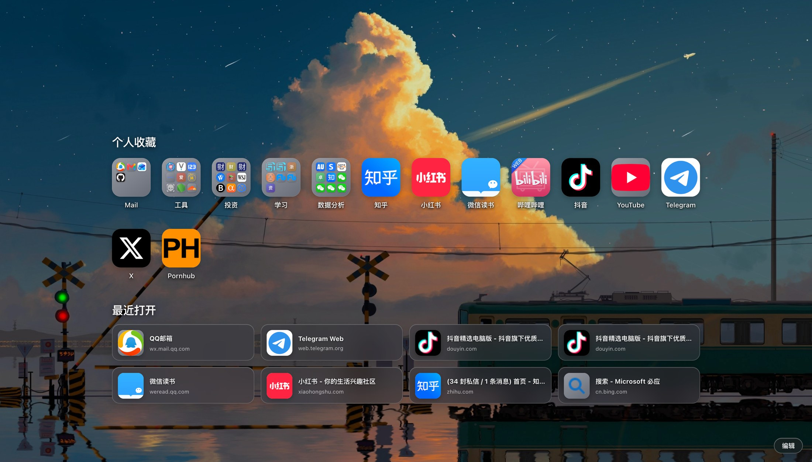
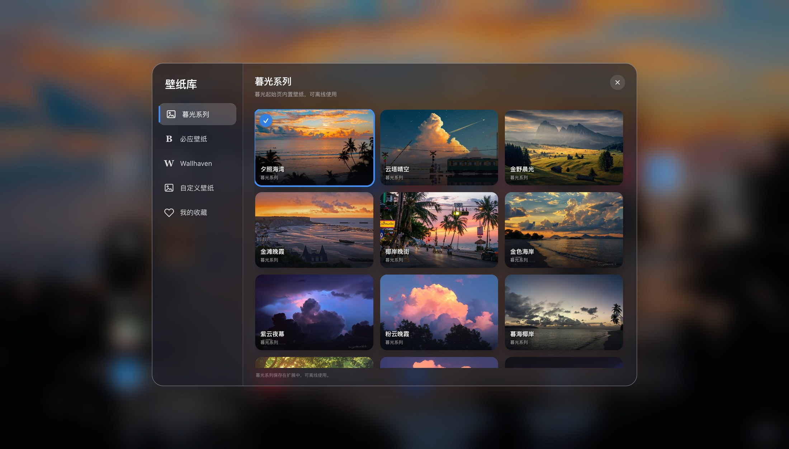

<div align="center">
  
  <h1>暮光起始页 · Twilight Start Page</h1>
  <p>将 Safari 的优雅起始页体验带到 Chrome。<br>Bring Safari's elegant start page experience to Chrome.</p>

  <p>
    <a href="https://github.com/404slsntfound/twilight-start-page/releases/latest"></a>
    <a href="https://github.com/404slsntfound/twilight-start-page/releases"></a>
    <a href="manifest.json"></a>
    <a href="LICENSE"></a>
  </p>
  <p><strong><a href="https://github.com/404slsntfound/twilight-start-page/releases/latest">下载最新版本 · Download latest release</a></strong></p>
  <p><a href="#简体中文">简体中文</a> · <a href="#english">English</a></p>
</div>



## 简体中文

暮光起始页是一款本地优先的 Chrome 新标签页扩展。它提供 Safari 风格的书签布局、分组预览、最近打开、网站图标与玻璃拟态壁纸库，并支持 Safari 和 Chrome 书签 HTML 导入导出。

### 亮点

| | 功能 |
|---|---|
| 🧭 | **Safari 风格布局**：细致调整图标尺寸、圆角、间距、行距、分组预览与玻璃拟态界面。 |
| 📁 | **独立收藏与分组**：书签由扩展自行管理，支持分组页面和拖动排序。 |
| 🕘 | **最近打开**：在个人收藏下显示最近访问的 8 个网页，可在编辑面板中开关，并带有平滑过渡动画。 |
| 🎨 | **灵活的网站图标**：可从网站官方页面发现 Touch Icon、Manifest 图标或 favicon，也可选择 Google 官方 favicon 服务或上传自己的图标。 |
| 🌇 | **暮光系列**：内置 12 张可离线使用的精选壁纸，默认使用“夕照海湾”。 |
| 🖼️ | **壁纸库**：浏览 Bing 与 Wallhaven 公开壁纸、收藏喜欢的图片，并保留最近 10 张自定义壁纸以便快速切换。 |
| 🔄 | **书签迁移**：导入或导出 Safari 与 Chrome 兼容的书签 HTML；导入时合并收藏并跳过重复网址。 |
| 🔒 | **本地优先**：不读取 Chrome 自带书签，不收集分析数据，不上传收藏、背景或自定义图标。 |

### 安装

1. 前往 **[最新版本](https://github.com/404slsntfound/twilight-start-page/releases/latest)**，下载 `twilight-start-page-*.zip` 并解压。
2. 在 Chrome 地址栏打开 `chrome://extensions/`。
3. 打开右上角的 **开发者模式**。
4. 点击 **加载已解压的扩展程序**。
5. 选择包含 `manifest.json` 的解压目录。
6. 新建标签页，即可使用暮光起始页。

更新时下载新版本并覆盖原目录，然后在 `chrome://extensions/` 中点击扩展卡片上的刷新按钮。

### 效果图

#### 夕照海湾


#### 粉云晚霞



#### 金野晨光



#### 晨光幻林



#### 云塔晴空



#### 暮光系列壁纸库



### 使用说明

- 点击书签打开网站；点击分组进入分组页面。
- 右击书签可重命名、编辑地址和图标、复制链接或删除书签。
- 拖动书签或分组可调整顺序。
- 点击右下角 **编辑** 可添加书签、创建分组、开关最近打开、进入壁纸库、刷新网站图标以及导入导出书签。
- 最近打开保留两排四列共 8 项，并在本机通过 Chrome 历史记录生成；关闭后不会继续读取历史记录。
- 壁纸库包含暮光系列、必应壁纸、Wallhaven、自定义壁纸和我的收藏。联网壁纸只会在打开相应分类时获取。
- **刷新网站图标** 会清除网站图标缓存并重新获取，不会删除自己上传的图标。
- **恢复初始内容** 会清空全部书签与分组，并恢复默认背景；操作前建议先导出书签 HTML。

### 图标来源

- **Safari 默认**：只从目标网站官方页面及同源资源发现 Touch Icon、Manifest 图标或 favicon。
- **Google 获取**：只使用 Google 官方 favicon 服务。
- **自己上传**：支持 SVG、PNG、JPEG、WebP 和 AVIF，文件保存在本机扩展存储中。
- 没有获取到图标时，使用书签名称首字生成方形图标。

### 权限与隐私

扩展申请 `storage`、`unlimitedStorage`、`history` 以及 `http://*/*`、`https://*/*` 网站访问权限。`history` 仅用于在本机生成最多 8 项最近打开记录；网站访问权限用于读取网站声明的图标资源，以及在用户打开相应分类时访问 Bing 与 Wallhaven 公开壁纸接口。扩展不申请 Chrome `bookmarks` 权限，不包含远程脚本。详情见 [隐私说明](PRIVACY.md)。

---

## English

Twilight Start Page is a local-first Chrome new tab extension with a Safari-inspired bookmark layout, group previews, recently opened sites, flexible website icons, and a glass wallpaper library. It also supports Safari and Chrome bookmark HTML import and export.

### Highlights

| | Feature |
|---|---|
| 🧭 | **Safari-inspired layout** with carefully tuned icon sizes, spacing, row gaps, group previews, and glass panels. |
| 📁 | **Independent bookmarks and groups** with dedicated group views and drag-to-reorder support. |
| 🕘 | **Recently opened** shows the latest eight visited pages below favorites, with an animated on/off control in the edit panel. |
| 🎨 | **Flexible website icons** discovered from official website resources, Google's official favicon service, or your own uploaded image. |
| 🌇 | **Twilight Collection** includes 12 handpicked offline wallpapers, with Sunset Bay as the default. |
| 🖼️ | **Wallpaper library** with public Bing and Wallhaven sources, favorites, and quick access to the ten most recent custom wallpapers. |
| 🔄 | **Bookmark migration** through Safari and Chrome compatible HTML import/export, with merging and URL deduplication. |
| 🔒 | **Local-first privacy** with no Chrome bookmark access, analytics, telemetry, or upload of your bookmarks and images. |

### Installation

1. Open the **[latest release](https://github.com/404slsntfound/twilight-start-page/releases/latest)**, download `twilight-start-page-*.zip`, and extract it.
2. Open `chrome://extensions/` in Chrome.
3. Enable **Developer mode**.
4. Click **Load unpacked**.
5. Select the extracted folder that contains `manifest.json`.
6. Open a new tab.

To update, replace the extension files with the latest release and click the reload button on its `chrome://extensions/` card.

### Screenshots

#### Sunset Bay


#### Pink Cloud Sunset


#### Golden Fields Dawn


#### Morning Light Forest


#### Cloud Tower Sky


#### Twilight wallpaper collection


### Icon sources

- **Safari Default** discovers Touch Icons, Manifest icons, and favicons only from the bookmarked site's official page and same-origin resources.
- **Google Fetch** uses Google's official favicon service only.
- **Custom Upload** supports SVG, PNG, JPEG, WebP, and AVIF and stays in local extension storage.
- A square initial tile is used when no icon is available.

### Privacy

The extension requests `storage`, `unlimitedStorage`, `history`, and access to `http://*/*` and `https://*/*`. History access is used locally to show at most eight recently opened pages. Website access is used for site-declared icons and, only when the related category is opened, public Bing and Wallhaven wallpaper endpoints. It does not request Chrome's `bookmarks` permission and includes no remote scripts. See the full [Privacy Notice](PRIVACY.md).

---

## Project

```text
├── manifest.json          # Chrome Manifest V3 configuration
├── newtab.html            # New tab page structure
├── styles.css             # Safari-inspired interface
├── app.js                 # Bookmarks, icons, drag sorting, and import/export
├── safari-bookmarks.js    # Initial data migration
├── assets/                # Extension icons, default background, and wallpapers
└── docs/images/           # Project screenshots
```

- Read the [changelog](CHANGELOG.md) for version history.
- Bug reports and feature ideas are welcome through [GitHub Issues](https://github.com/404slsntfound/twilight-start-page/issues).
- See [CONTRIBUTING.md](CONTRIBUTING.md) before submitting a change.

## Disclaimer

Twilight Start Page is an independent project inspired by Safari's start page. It is not affiliated with or endorsed by Apple, Google, or the websites shown in the screenshots. Product names and logos belong to their respective owners.

## License

[MIT](LICENSE)

<div align="center">
  如果暮光起始页对你有帮助，欢迎为项目点一颗 Star。<br>
  If Twilight Start Page is useful to you, consider starring the repository.
</div>
